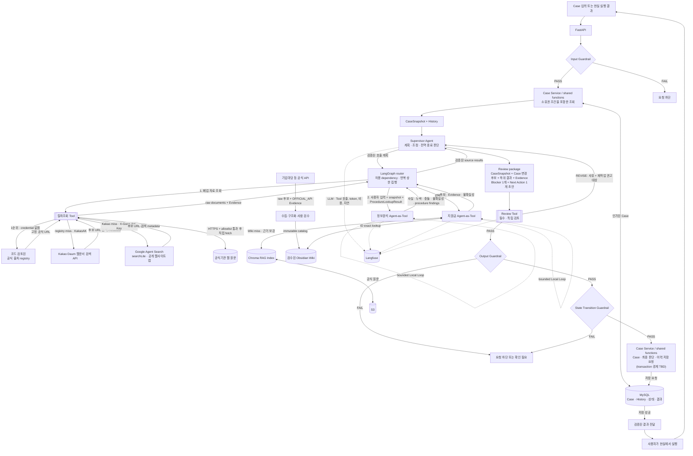

# RE:BORN Agent 아키텍처

> **상태 (2026-09-15):** 이 문서는 현재 실행 코드와 생산 목표 구조를 함께 설명합니다. **현재**와 **목표** 표기가 다르면 현재 표기가 실제 동작의 기준이며, 실행 현황은 `agent-standalone-runtime-requirements.md`가 기준입니다.
>
> 필드·enum·API JSON 같은 세부 계약은 이 문서에서 정하지 않습니다. 이 문서는 구성요소의 책임, 호출 방향, 루프, 검증 경계만 다룹니다.

## 1. 현재 구현과 생산 목표를 먼저 구분

| 구분 | 오케스트레이션 소유자 | 실제 의미 |
|---|---|---|
| **현재 코드** | `AgentGraph` | `CASE_CREATED`·`RESULT_SUBMITTED`는 `Procedure → Info → Support → Supervisor → Review`, `SUPPORT_REFRESH`는 `Support → Supervisor → Review`로 시작합니다. Supervisor는 하위 구성요소를 호출하지 않고 이미 모인 결과로 초안을 만듭니다. |
| **생산 목표** | Supervisor의 계획을 실행하는 Graph router | Supervisor가 Case와 실행 상태를 보고 필요한 구성요소를 선택하고, Graph가 그 결정을 제한된 dependency 안에서 실행합니다. 이 동적 planning용 호출 계획 schema와 router는 아직 구현되지 않았습니다. |

`SupervisorRunInput`이라는 타입 이름은 top-level 실행 입력을 뜻할 뿐, 현재 Graph가 Supervisor부터 실행한다는 뜻이 아닙니다. 현재 Info·Support는 `analyze(...)` Python 인터페이스로 호출됩니다. “Agent-as-Tool”은 Supervisor 관점의 목표 오케스트레이션 인터페이스이며, 현재 LangChain Tool이나 내부 HTTP endpoint로 등록됐다는 뜻이 아닙니다.

현재와 목표가 공유하는 불변식은 다음과 같습니다.

- 절차조회 Tool은 코드 검토된 공식 출처 registry를 먼저 확인하고, registry miss일 때만 Kakao→Google 순서로 URL을 발견합니다. 검증된 원문을 직접 읽되 내용을 해석하거나 Case 적용 여부를 판정하지 않습니다.
- 절차조회 Tool이 Info Agent를 호출하지 않습니다. 현재는 `AgentGraph`가 `ProcedureLookupResult`와 해당 call ID를 `InfoAnalysisInput`에 넣습니다. 목표에서는 Supervisor의 검증된 계획을 Graph가 같은 방식으로 전달합니다.
- Info·Support·Procedure는 서로 직접 호출하거나 메시지를 주고받지 않습니다.
- Supervisor가 만든 모든 정상 초안은 Review Tool을 거칩니다. Info가 확정값 충돌을 발견해 조기 반환하는 `CONFLICT`는 Supervisor 초안이 아니므로 이 Review 경로의 예외입니다.
- 별도 업무 Rule 엔진은 두지 않습니다. schema, provenance, 허용된 상태 전이처럼 결정적으로 판정 가능한 안전 조건만 코드 Guardrail로 강제합니다.

| 구성요소 | 현재 실행 책임 | 생산 목표에서 추가될 책임 | 하지 않는 일 |
|---|---|---|---|
| **`AgentGraph`** | trigger별 첫 경로, 결과 전달, Review 재작업 경로, 최대 반복과 safe failure 관리 | Supervisor의 검증된 호출 계획을 실행하는 동적 router | 업무 근거 생성, 인증·DB 저장 |
| **Supervisor Agent** | 전달된 Procedure·Info·Support 결과로 초안을 만들고 `ACTION`이면 Blocker·Next Action 각 1개를 선택 | 필요한 하위 구성요소 선택, 결과 충분성·되묻기·종료 판단까지 Global Loop 소유 | 하위 구성요소 직접 네트워크 호출, Guardrail·Review 우회, 전문 근거 임의 생성 |
| **정보분석 Agent** | redacted 사용자 입력·`CaseSnapshot`·절차 원문을 분석해 사실·누락·충돌·불확실성과 canonical step에 결합된 `procedure_findings` 생성 | 현재 책임 유지 | 인터넷 직접 검색, lookup에 없는 절차 생성, DB step ID 생성, Case 직접 변경 |
| **지원금 Agent** | 주입된 immutable `ReviewedSupportCatalog` 후보를 Case 사실과 비교하고 Evidence 연결 | 검수 Wiki/RAG resolver를 이용한 제한된 검색·보강 | raw API 공고 자동 승격, 지원 자격·수령 확정, 다른 Agent 호출, Wiki 자동 수정 |
| **지원 공고 discovery adapter** | Graph 밖에서 기업마당 공식 API의 raw 후보와 `OFFICIAL_API` Evidence 생성 | 수집·검수 pipeline의 read adapter | Support Agent 자동 주입, 자격 판정, `ReviewedSupportCatalog` 자기 승격 |
| **절차조회 Tool** | 공식 registry→Kakao→Google URL discovery, HTTPS·allowlist 검증, 공식 원문 fetch와 raw document/Evidence 정규화 | 공식 source registry 확대와 운영 resolver 연동 | snippet을 Evidence로 사용, 원문 해석, 적용성·순서·우선순위·완료·Next Action 판정, DB ID 생성 |
| **Review Tool** | subject/digest/provenance를 코드로 확인하고, LLM 검토 결과와 결정적 안전 검사를 병합 | 현재 책임 유지 | 새 근거 검색, 초안 직접 수정, 구성요소 직접 재호출 |
| **Case Service / PlanningCoordinator** | 현재 미연결 | 인증된 snapshot 조립, 소유권·CAS·상태 전이·원자적 저장 | Agent 업무 판단 대체 |

## 2. Rule 엔진을 없앤 이유

기존 구조는 절차 선후관계와 Next Action 우선순위를 Rule 엔진이 결정했습니다. 이 경우 LLM은 앞에서 자연어를 파싱하고 뒤에서 정해진 결과를 문장으로 바꾸는 역할만 남아, 문서에 적었던 것처럼 자율적인 Agent 구조가 아니었습니다.

Rule 엔진을 둔 목적은 지원 자격·금액·세무 내용을 함부로 단정하지 못하게 하는 것이었습니다. 그러나 존재하지 않는 지원사업명, 잘못된 금액·기한 같은 심각한 오류는 사실을 생성하거나 조회하는 시점에 생기므로, 뒤의 Rule만으로 막을 수 없습니다.

따라서 방어선을 다음처럼 옮깁니다.

- 공식 Evidence가 없는 지원사업명·금액·기한은 확정 문장으로 만들지 않습니다.
- 출처가 없거나 오래됐거나 Case 조건이 부족하면 `확인 필요`로 다룹니다.
- 절차조회 Tool은 실제 인터넷에서 공식 원문을 가져오고, 정보분석 Agent가 그 원문을 Case 문맥에서 분석하며, 최종 우선순위는 Supervisor가 판단합니다.
- 소유권·상태 전이·출력 형식처럼 확률에 맡길 수 없는 항목만 코드가 강제합니다.

## 3. 전체 실행 흐름

### 3.1 현재 코드의 고정 실행 흐름

```text
CASE_CREATED | RESULT_SUBMITTED
  → ProcedureLookupTool
  → InfoAnalysisAgent
      ├─ confirmed fact와 새 입력이 충돌 → CONFLICT로 즉시 종료
      └─ 충돌 없음 → SupportAgent
                      → SupervisorAgent
                      → ReviewTool
                          ├─ PASS → REVIEWED_PLAN
                          ├─ REVISE → 원인상 가장 앞선 구성요소부터 재실행
                          └─ 예외 또는 재작업 상한 소진 → SAFE_FAILURE

SUPPORT_REFRESH
  → SupportAgent → SupervisorAgent → ReviewTool
```

이 순서는 [`AgentGraph._compile`](../backend/app/agent/graph.py)과 `_route_start`에 고정돼 있습니다. 현재 Supervisor는 첫 구성요소를 고르지 않습니다. `SUPPORT_REFRESH`에는 사용자 `RedactedInput`이 없으므로 첫 실행에서 Procedure와 Info를 생략합니다.

| 전달 단계 | Graph가 실제로 넘기는 값 | 필요한 이유 |
|---|---|---|
| Procedure → Info | 정확히 한 `ProcedureLookupResult`, Procedure call ID, snapshot ID | Info 해석이 어느 원문 조회 실행에서 나왔는지 고정 |
| Info → Support | 검토 전 `FactChangeCandidate` overlay와 관련도가 `RELEVANT` 또는 `POSSIBLY_RELEVANT`인 canonical procedure step | 아직 DB에 쓰지 않고도 같은 실행 안에서 지원 조건 비교 |
| Procedure·Info·Support → Supervisor | 현재 run의 `ReviewSourceResult[]`와 digest | Supervisor가 새 근거를 만들지 못하고 받은 결과 안에서만 초안 작성 |
| source results + Supervisor draft → Review | immutable `ReviewSubject`와 `subject_digest` | 검토 뒤 payload가 바뀌거나 다른 실행 결과가 섞이는 것을 차단 |
| Review PASS → caller | `ReviewedPlanOutcome` + `ReviewProof` | 검토된 초안과 proof를 함께 반환하되 DB에는 쓰지 않음 |

기업마당 `BizInfoSupportDiscoveryTool`은 이 흐름에 들어오지 않습니다. 현재 CLI도 discovery 결과를 읽지 않으며, `fixtures.py`의 합성 `ReviewedSupportCatalog`를 Support Agent에 주입합니다. raw discovery 후보를 catalog로 바꾸는 검수 pipeline이 생기기 전에는 두 경로를 연결하지 않습니다.

### 3.2 생산 목표 흐름



이 그림 전체는 **생산 목표**입니다. FastAPI/Case Service/MySQL persistence, Supervisor 동적 호출 선택과 그 계획을 실행할 Graph router, Obsidian→Chroma→S3, Langfuse 선은 현재 미연결입니다. 현재 standalone CLI는 합성 `CaseSnapshot`·합성 `ReviewedSupportCatalog`를 현재의 고정 LangGraph에 넣고, `httpx` 기반 LLM 호출과 공식 registry 원문 fetch를 수행합니다. `AgentGraph.run(...)` 자체는 schema-valid caller 입력을 받을 수 있지만, 이를 실제 사용자 Case에서 인증·조립하는 adapter는 아직 없습니다.

현재 `REVIEWED_PLAN`의 전달 조건은 **Agent 내부 schema/provenance Guardrail과 Review PASS**입니다. 생산에서는 여기에 PlanningCoordinator의 Input·Output·State Transition Guardrail과 CAS 저장 성공이 추가됩니다. Supervisor 초안을 Review 없이 `REVIEWED_PLAN`으로 내보내는 현재 분기는 없습니다.

현재 첫 계획의 데이터 의존 순서는 **절차조회 → 정보분석 → 지원금 → Supervisor 초안 → Review**입니다. 이 순서는 하위 구성요소가 서로 호출한다는 뜻이 아니라, LangGraph가 앞 호출의 검증된 결과를 다음 호출 입력에 전달한다는 뜻입니다. 목표 구조에서는 Supervisor가 이 선택까지 소유합니다. Kakao/Google이 반환하는 검색 metadata와 snippet은 URL 발견용일 뿐 공식 원문 자체가 아니므로 검색과 공식 원문 fetch를 분리합니다. 지원사업 공식 API 수집은 사용자 요청 Graph와 분리된 ingestion 경계이며, 검수되지 않은 raw 공고를 Support Agent에 바로 넣지 않습니다.

위 그림은 논리적 검증 순서를 나타냅니다. Case 상태와 최종 판단을 몇 개의 짧은 트랜잭션으로 나눌지, 재계획 실패 시 앞선 상태 변경을 유지할지는 아직 BE 계약 전이므로 확정하지 않습니다.

## 4. 루프와 권한

| 현재 반복 경계 | 소유자 | 기본 상한 | 코드상 동작 |
|---|---|---|---|
| Info 의미·grounding 재시도 | Info Agent | 총 3회 | provider 출력이 canonical field/value/source span 검증에 실패하면 보수적 재생성 |
| Support 의미·grounding 재시도 | Support Agent | 총 3회 | immutable catalog의 ID·조건·Evidence와 다르면 보정 프롬프트로 재생성 |
| Supervisor 초안 재시도 | Supervisor Agent | 총 3회 | decision·target·claim·provenance 검증 실패 시 재생성하고, 가능한 경우 질문 전용 보수적 fallback 사용 |
| Review 출력 재시도 | Review Tool | 총 2회 | JSON Pointer·subject reference·PASS/REVISE 계약이 틀리면 재생성 |
| Procedure 외부 요청 재시도 | Procedure Tool | 기본 재시도 1회 | provider 검색·원문 fetch의 일시적 실패만 전체 lookup deadline 안에서 재시도 |
| Review 재작업 | `AgentGraph` | 최대 2회 | 첫 Review 뒤 최대 두 번 재작업하므로 Review attempt는 최대 3 |

현재 Global Loop의 routing 소유자는 Supervisor가 아니라 `AgentGraph`입니다. Review의 검증된 issue target 중 dependency상 가장 앞선 항목을 택해 다음처럼 source result를 버리거나 재사용합니다.

| 가장 앞선 문제 소유자 | 재사용하는 결과 | 다시 실행하는 범위 |
|---|---|---|
| `PROCEDURE_TOOL` | 없음 | Procedure → Info → Support → Supervisor → Review |
| `INFO_AGENT` | Procedure | Info → Support → Supervisor → Review |
| `SUPPORT_AGENT` | Procedure + Info | Support → Supervisor → Review |
| `SUPERVISOR` 또는 target 없음 | Procedure + Info + Support | Supervisor → Review |

Review Tool은 모델이 적은 rework 목록을 그대로 신뢰하지 않고, 검증된 blocking issue의 소유 경로와 missing Evidence를 기준으로 target을 다시 계산합니다. Graph는 그 target의 의존 순서를 결정적으로 적용합니다. **목표 구조**에서는 Supervisor가 이 검증된 사유 안에서 Global Loop를 계획하고 Graph는 권한·상한을 집행합니다.

- Local retry는 해당 구성요소의 형식·의미 검증을 통과하기 위한 반복이지, 다른 Agent를 호출하는 전역 계획이 아닙니다.
- 하위 Agent는 서로를 호출하지 않으며 사용자에게 실제 질문을 보낼지 결정하지 않습니다.
- 초안이 바뀌면 새 `ReviewSubject`와 digest를 만들고 이전 Review 결과를 재사용하지 않습니다.
- 재작업 상한을 소진하거나 구성요소 예외가 발생하면 현재 Graph가 `SafeFailureOutcome`을 직접 반환합니다. 아직 미구현인 생산 Output Guardrail을 통과했다고 표현하지 않습니다.
- 추가 질문·사용자 확인 요청처럼 도메인 판단이 들어간 Supervisor 초안도 Review 대상입니다. 외부 HTTP 오류·저장 상태 매핑은 BE 연동 TBD입니다.

## 5. 생산 Guardrail 목표와 Review의 경계

### 5.1 PlanningCoordinator 코드 Guardrail — 결정 가능한 세 지점

| 지점 | 코드가 강제하는 것 |
|---|---|
| **Input** | 요청 형식·필수 필드, 인증·Case 소유권, 허용된 요청 여부 |
| **State Transition** | 상태 전이 유효성, 이미 확인된 값의 자동 덮어쓰기 금지, 허용되지 않은 상태 변경 차단, Case Service 경유 |
| **Output** | 응답 형식·필수 정보, 허용된 값, 민감정보 필터링, 출력 계약 준수 |

이 표는 생산 연결 목표입니다. 현재 standalone에는 strict schema·provenance/digest·구성요소별 local Guardrail과 safe-failure가 있지만, 인증된 입력 및 persistence 앞의 세 Guardrail은 아직 없습니다. 생산 Guardrail은 자연어끼리 의미가 충돌하는지, “이 변경에 사용자 확인이 필요한가”, “이 Evidence가 주장을 충분히 뒷받침하는가”처럼 문맥을 읽어야 하는 판단을 하지 않습니다. 이 판단은 Supervisor와 Review가 담당하고, 코드는 확인되지 않은 변경을 저장하지 못하게 강제해야 합니다.

### 5.2 Review Tool — 문맥을 읽어야 하는 품질 검증

Review Tool은 Supervisor와 분리된 프롬프트·실행 컨텍스트에서 다음을 확인합니다. 다른 LLM 모델을 써야 하는 것은 아니며, 독립된 관점이 유지되는지가 핵심입니다.

- Agent 결과가 Case와 일치하는가
- 주장에 필요한 Evidence가 실제로 첨부됐고 해당 주장을 뒷받침하는가
- 정보분석의 `procedure_findings`가 같은 실행의 `ProcedureLookupResult`에 포함된 공식 원문 Evidence에서 도출됐는가
- 근거 없는 단정이나 과도한 확신이 없는가
- Blocker와 Next Action이 현재 상황에 맞고 현실에서 실행 가능한가
- Next Action의 required `PROCEDURE | SUPPORT_PROGRAM` target이 각각 정확히 한 Info finding 또는 Support check와 Evidence에 연결되는가
- 사용자 확인이 필요한 내용을 임의로 확정하지 않았는가
- 불필요한 전문용어와 모호한 표현이 없는가

Review는 새 Evidence를 검색하지 않습니다. 필요한 Evidence가 없으면 즉시 `REVISE`하고, 문제·사유·누락 근거·재작업 권고 대상을 반환합니다. 초안을 직접 고치거나 하위 Agent를 직접 호출하지 않습니다.

## 6. Evidence, 절차조회와 지원금 조회

```text
폐업 관련 비식별 질의
  → 코드 검토된 공식 출처 registry에서 고정 URL 선택
       └─ registry miss: Kakao, 다시 miss면 Google로 URL 발견
  → HTTPS 및 공식기관 domain allowlist 검증
  → 검증된 URL의 실제 원문 직접 fetch
       ├─ 성공: sanitized excerpt + URL + 기관 + 조회시각 + hash를 Evidence로 반환
       └─ 실패/차단: warning 또는 부분 결과; 검색 snippet으로 대체하지 않음
  → 현재 AgentGraph가 raw ProcedureLookupResult와 call ID를 정보분석 Agent에 전달
  → 정보분석 Agent가 canonical KnownProcedureStep에만 procedure finding 결합
```

검색 질의는 Case의 확정된 업종·사업자 유형·직원 수와 redacted 입력의 제한된
키워드(`카페`, `음식점`, `법인`, `직원` 등)로 **미리 정의된 비식별 검색어만
선택**합니다. 사용자 문장이나 주소를 검색 API로 복사하지 않으므로 첫 자연어
입력에서도 업종별 자료를 찾되, 검색 질의 생성이 정보분석을 대신하지 않습니다.

- 외부 웹문서의 본문은 **명령이 아니라 신뢰하지 않는 데이터**입니다. 문서에 포함된 prompt, 링크 이동 지시, credential 요청을 실행하지 않습니다.
- `source_policy=OFFICIAL_ONLY`이며 최종 URL과 모든 redirect hop은 HTTPS와 공식기관 allowlist를 통과해야 합니다. 현재 runtime은 IP-literal과 credential 포함 URL을 거부합니다. hostname DNS 해석 결과의 private/loopback/link-local 차단과 DNS rebinding 방어는 production egress/resolver 경계에서 추가해야 합니다.
- Kakao/Google 검색 결과의 제목·snippet·작성시각 등 metadata는 URL 발견과 후보 정렬에만 사용합니다. 각 문서는 `discovery_provider`로 실제 발견 provider를 남기며, 직접 fetch한 실제 공식 원문만 `OFFICIAL_DOCUMENT` Evidence가 될 수 있습니다.
- Google 검색은 공개 공식사이트만 등록된 Agent Search 앱의 공식 `searchLite` JSON API로 수행합니다. `google.com/search` 결과 HTML을 요청하거나 parsing하는 SERP scraping은 하지 않습니다. 네이버 검색 API는 AI 입력을 금지한 현행 이용조건 때문에 사용하지 않습니다.
- `published_at` 또는 최신성을 확인하지 못하면 `freshness_status=UNKNOWN`입니다. 정보분석·Supervisor는 이 근거로 기한·필수서류·법적 의무를 확정형으로 말하지 않습니다.
- 인터넷 자료만으로 `CASE_COMPLETE`를 만들거나 절차 진행상태를 저장하지 않습니다. 완료에는 사용자 실행, 전문가 확인, 공식 처리 결과처럼 현실 실행을 증명하는 별도 Evidence가 필요합니다.

```text
검수된 지원항목 ID가 있음
  └─ Obsidian Wiki에서 ID exact lookup

Wiki miss 또는 근거 보강 필요
  └─ Chroma에서 관련 공식 원문 검색
       └─ S3 원문과 최신성 확인
            ├─ 충분함: 후보 + Evidence 반환
            └─ 부족함: 검색 전략 보정 또는 확인 불가 반환
```

- 지원금 Agent는 검수된 Wiki를 자동 수정하지 않습니다.
- 기업마당 API의 raw 공고는 별도 discovery/ingestion 출력이며, 조건·서류·기간을 검수한 뒤에만 immutable catalog로 승격합니다.
- 공식 출처가 없거나 `STALE`이면 지원 자격·금액·기한을 확정하지 않습니다.
- 지원기관의 최종 심사 전에는 “지원 가능 확정”이나 “수령 확정”으로 표현하지 않습니다.
- 정보분석의 사용자 발화 근거는 원문 전체가 아니라 필요한 source span과 출처 유형으로 전달합니다.

## 7. 역할 기반으로 나눈 이유

임대차·철거·세무·지원금처럼 도메인마다 Agent를 추가하면 도메인이 늘 때마다 오케스트레이션 구조도 커지고, 어느 판단이 결과를 만들었는지 추적하기 어려워집니다.

따라서 전역 판단은 Supervisor에 모으고 하위 구성요소는 정보 분석, 근거 조회, 절차 조회, 품질 검토라는 역할로 나눕니다. 2차 MVP에서 세무·철거 범위를 확장할 때도 먼저 지식원과 필요한 조회 Tool을 추가하며, 독립된 계획·Local Loop가 필요한 근거가 생기기 전에는 새 Agent를 만들지 않습니다.

## 8. 프레임워크와 관측성

| 기술 | 현재 사용 범위와 상태 |
|---|---|
| **httpx** | 현재 LLM structured-output endpoint와 공식 API/문서에 직접 요청 |
| **LangChain** | 패키지만 설치됨. 현재 Agent LLM·Tool runtime에는 사용하지 않으며, 향후 adapter 선택지 |
| **LangGraph** | **현재 사용 중.** trigger별 고정 first-pass dependency, 필수 Review 경로, Review 재작업 routing과 종료 상태 관리. 구성요소 내부 local retry 자체는 각 Python 클래스가 관리 |
| **Langfuse** | 패키지·예시 환경변수만 존재. trace sink adapter와 비용 전송은 **미구현** |
| **Obsidian/Chroma/S3** | 검수 catalog/RAG 생산 목표. 현재 standalone은 합성 catalog를 직접 주입하며 resolver·index **미구현** |

- Response Writer는 판단 노드나 별도 Agent가 아닙니다. Supervisor가 결정한 Blocker·Next Action을 출력 계약에 맞게 직렬화하는 단계입니다.
- 현재 Info·Support의 “Agent-as-Tool”은 typed Python 호출 경계입니다. LangChain Tool 등록이나 구성요소별 HTTP 서비스는 아직 없습니다.
- Agent별로 다른 모델을 써야 하는 것은 아닙니다. 프롬프트, 허용된 입력, 상태와 실행 컨텍스트를 분리해 독립성을 확보합니다.
- Langfuse를 연결할 때도 인증 토큰과 민감한 원문을 그대로 기록하지 않습니다. 현재 기본 sink는 `NullTraceSink`이며 상세 보존·마스킹·비용 정책을 확정한 뒤 adapter를 구현합니다.
- 생산 목표는 MySQL에 Case의 최종 상태와 업무 감사 이력을, Langfuse에 비식별 중간 실행·token·비용 관측을 남기는 것입니다. 두 저장소의 공통 식별자와 보존 범위는 아직 TBD입니다.

## 9. MVP 범위

### 현재 구현된 Agent 코어

- Supervisor Agent
- 정보분석 Agent-as-Tool
- 지원금 Agent-as-Tool
- 절차조회 Tool
- 필수 Review Tool
- Graph와 분리된 기업마당 지원 공고 discovery adapter
- strict Pydantic schema, provenance/digest 검사, 구성요소별 deterministic local Guardrail, safe-failure 경계

### 생산 연결 목표

- 인증된 CaseSnapshot/CASES·History persistence
- PlanningCoordinator의 Input / Output / State Transition Guardrail
- 기업마당 raw 공고 → 검수된 immutable catalog pipeline
- Wiki → Chroma → S3 근거 조회 경로
- Langfuse 비식별 trace·token·비용 관측

### 2차 MVP 확장

- 세무·철거 지식원과 필요한 조회 Tool
- 현재 구조로 표현할 수 없는 독립 목표와 bounded loop가 확인될 때만 별도 Agent 여부 재검토

## 10. 구현 소유권과 생산 연동 TBD

| 구분 | 소유 |
|---|---|
| Supervisor·하위 Agent·Tool 동작, 프롬프트, Agent 입출력 schema, 절차조회 Tool, LangGraph, 향후 Langfuse adapter | AI |
| 인증·소유권, DB API, Case Service/shared functions, 물리 DB·migration, 상태 전이 코드, 트랜잭션 | BE |
| CaseSnapshot, Evidence 식별자 연결, 최종 결과 저장 DTO, 오류·실패 계약 | AI가 필요 schema를 제안하고 BE와 인터페이스 확정 |

현재 standalone에서 실행되는 v2 입출력·Review schema와 로컬 retry/timeout은
`agent-tool-io-schema.md`의 **현재 구현** 절과 Python 코드로 고정돼 있습니다.
Supervisor 동적 planning, BE HTTP envelope, 외부 resolver, persistence schema는
같은 문서의 **목표/제안 계약**이며 구현 완료가 아닙니다. 아래는 생산 연결 전에
공동 계약이 더 필요한 항목입니다.

- BE/gateway 전체 deadline과 Agent 내부 retry/timeout의 소유권·중복 실행 방지
- `ComponentRequest`/`ComponentResult` HTTP envelope와 BE 영속 Evidence ID 발급·resolver 형식
- 공식 출처 registry 변경 승인, 선택 Kakao/Google credential 운영, provider별 quota/비용, 공식기관 allowlist 변경 승인, DNS rebinding/egress 관측
- 기업마당 raw 공고의 원문/첨부 수집, 사람 검수와 `ReviewedSupportCatalog` 버전 승격 경계
- 국세청 상태·행안부 인허가 API에 전달할 사업자 식별정보의 동의·암호화·마스킹·감사 계약
- 인터넷 조회 Evidence의 canonical URL·본문 hash·조회시각 보존과 캐시/재검증 정책
- BE canonical `ProcedureStepRef` registry 공급·버전 관리와 미매핑 finding 처리
- Review 결과·`ReviewProof`의 외부 HTTP 오류 매핑과 저장 승인 절차
- 논리 schema의 `CASES.version`을 실제 migration/CAS로 구현하는 방식과 충돌 응답
- Case 갱신·최종 판단·History 저장의 정확한 트랜잭션 경계
- MySQL 업무 이력과 Langfuse 실행 trace에 각각 남길 정보와 보존 정책

LLM 호출과 외부 조회를 긴 DB 트랜잭션 안에서 실행하지 않는다는 원칙은 유지합니다. Case 변경과 그 변경 이력의 원자성, Review 최종 실패 시 저장 상태는 BE 계약이 확정된 뒤 반영합니다.

## 11. 불변식

- Blocker 1개와 Next Action 1개의 최종 판단은 Supervisor만 합니다.
- 하위 Agent·Tool은 서로 직접 호출하거나 메시지를 주고받지 않습니다.
- Review는 모든 Supervisor 정상 초안에 필수이며 건너뛸 수 없습니다. Info가 만든 `CONFLICT` 조기 결과와 `SAFE_FAILURE`는 정상 초안이 아니므로 ReviewProof를 갖지 않습니다.
- Review는 전달받은 Evidence만 검증하고 새 근거를 만들거나 찾지 않습니다.
- Agent와 Tool은 DB를 직접 변경하지 않습니다.
- 절차조회 Tool은 raw 원문과 Evidence만 반환하며 적용성·준비상태·완료·우선순위를 판정하지 않습니다.
- 정보분석 Agent는 caller가 제공한 `KnownProcedureStep`에만 finding을 결합하고 새 DB step ID/code를 만들지 않습니다.
- 공식 registry URL도 실제 fetch와 allowlist 검증을 통과해야 Evidence가 됩니다. Kakao/Google 검색 snippet이나 allowlist를 통과하지 않은 페이지는 Evidence가 아닙니다.
- 기본 정책의 모든 질의는 공식 출처 registry를 먼저 시도하고, miss일 때만 Kakao→Google 순서로 fallback합니다. registry를 명시적으로 끈 구성은 Kakao→Google 순서이며, Google SERP HTML scraping과 Naver 검색 결과의 AI 입력은 허용하지 않습니다.
- 기업마당 discovery 결과는 검수·version 발행 전까지 Support Agent나 사용자 요청 Graph의 입력이 아닙니다.
- 근거 없는 지원사업명·금액·기한·자격 확정 문장을 사용자에게 내보내지 않습니다.
- 판단, 호출, 반송, 실패 원인은 추적할 수 있어야 합니다.

## 12. 현재 구현 근거

| 확인 대상 | 권위 코드 | 문서 결론 |
|---|---|---|
| trigger별 첫 경로와 Review 재작업 | [`graph.py`](../backend/app/agent/graph.py)의 `_compile`, `_route_start`, `_route_after_review`, `_retain_sources_for_rework` | 현재 fixed dependency와 최대 2회 재작업은 Graph 소유 |
| Graph 상태 | [`state.py`](../backend/app/agent/state.py)의 `AgentGraphState`, `GraphPhase` | 중간 결과는 run 메모리에만 있고 persistence state가 아님 |
| Procedure → Info 전달 | [`graph.py`](../backend/app/agent/graph.py)의 `_procedure_node`, `_info_node` | Graph가 lookup result·call ID를 Info 입력에 결합하며 Tool이 Info를 호출하지 않음 |
| Info → Support 전달 | [`graph.py`](../backend/app/agent/graph.py)의 `_support_node` | fact overlay와 관련 canonical step을 PlanningContext에 결합 |
| Supervisor의 현재 위치 | [`supervisor/agent.py`](../backend/app/agent/supervisor/agent.py)의 `SupervisorAgent.draft` | 이미 수집된 source results로 초안을 만들며 호출 계획을 반환하지 않음 |
| Review 관문과 proof | [`review_tool/tool.py`](../backend/app/agent/review_tool/tool.py)의 `ReviewTool.review`, [`schemas.py`](../backend/app/agent/schemas.py)의 `ReviewSubject`, `ReviewProof`, `ReviewedPlanOutcome` | 독립 검토와 digest가 일치한 PASS에만 reviewed outcome 발급 |
| standalone 데이터 | [`cli.py`](../backend/app/agent/cli.py)의 `_run`, [`fixtures.py`](../backend/app/agent/fixtures.py)의 `build_standalone_fixture` | CLI Case·procedure step·support catalog는 합성이며 Procedure 원문과 LLM만 live |
| 지원 discovery 분리 | [`support_agent/discovery_tool.py`](../backend/app/agent/support_agent/discovery_tool.py)의 `BizInfoSupportDiscoveryTool`, [`graph.py`](../backend/app/agent/graph.py) import/노드 목록 | raw 기업마당 adapter는 구현됐지만 Graph node나 CLI dependency가 아님 |

## 13. 외부 기술 근거

- [공식 API·크롤링·RAG 데이터 소스 조사](./agent-official-data-source-strategy.md): API별 실호출 상태, 필요한 활용신청, 수집·검수·RAG 경계
- [기업마당 지원사업정보 API](https://www.bizinfo.go.kr/apiDetail.do?id=bizinfoApi): 현재 사용 가능한 공식 지원 공고 discovery 계약
- [국세청 사업자등록정보 상태조회 API](https://www.data.go.kr/data/15081808/openapi.do): 사업자 상태·폐업일 확인 계약
- [행정안전부 휴게음식점 인허가 API](https://www.data.go.kr/data/15154921/openapi.do): 카페 인허가 상태·폐업일 데이터
- [국가법령정보 공동활용 안내](https://open.law.go.kr/LSO/information/guide.do): 법령·조문·서식 API 신청과 사용 근거
- [찾기쉬운 생활법령 저작권 정책](https://www.easylaw.go.kr/CSP/AboutCopyright.laf?topMenu=introUl3): 고정 공식 문서 수집 시 출처·원 URL 보존 근거
- [네이버 검색 API 이용약관 변경 공지](https://developers.naver.com/notice/article/33400): 검색 결과를 AI 입력·개발에 사용하지 않는 근거
- [Google Agent Search `searchLite` REST API](https://docs.cloud.google.com/generative-ai-app-builder/docs/reference/rest/v1/projects.locations.collections.engines.servingConfigs/searchLite): 공개 웹사이트 검색에서 API key 인증을 허용하는 `POST ...:searchLite` 계약과 `query`·`pageSize`·`SearchResponse`를 정의
- [Google Agent Search 웹사이트 데이터 준비](https://docs.cloud.google.com/generative-ai-app-builder/docs/prepare-data): 검색 앱이 조회할 공개 웹사이트 URL pattern을 사전에 포함·제외하고 Google이 해당 범위를 crawl/index한다는 근거
- [Google Cloud API key 인증](https://docs.cloud.google.com/docs/authentication/api-keys-use): API key를 URL query보다 `X-Goog-Api-Key` header로 전달하라는 보안 근거
- [Kakao Daum 검색 REST API 개발 가이드](https://developers.kakao.com/docs/ko/daum-search/dev-guide): 웹문서 검색 endpoint, `Authorization: KakaoAK ${REST_API_KEY}`, query/page/size와 검색 결과의 title/contents/url/datetime 계약
- [Kakao REST API 시작하기](https://developers.kakao.com/docs/ko/rest-api/getting-started): 서버 환경에서 REST API를 호출할 수 있다는 공식 안내
- [Kakao 앱 키 설정](https://developers.kakao.com/docs/ko/app-setting/app): REST API 키의 발급·관리·호출 허용 IP 설정 근거
- [Kakao 쿼터 안내](https://developers.kakao.com/docs/ko/getting-started/quota): Daum 검색 사용량과 쿼터가 변경될 수 있으므로 timeout·rate limit·운영 관측이 필요하다는 근거
