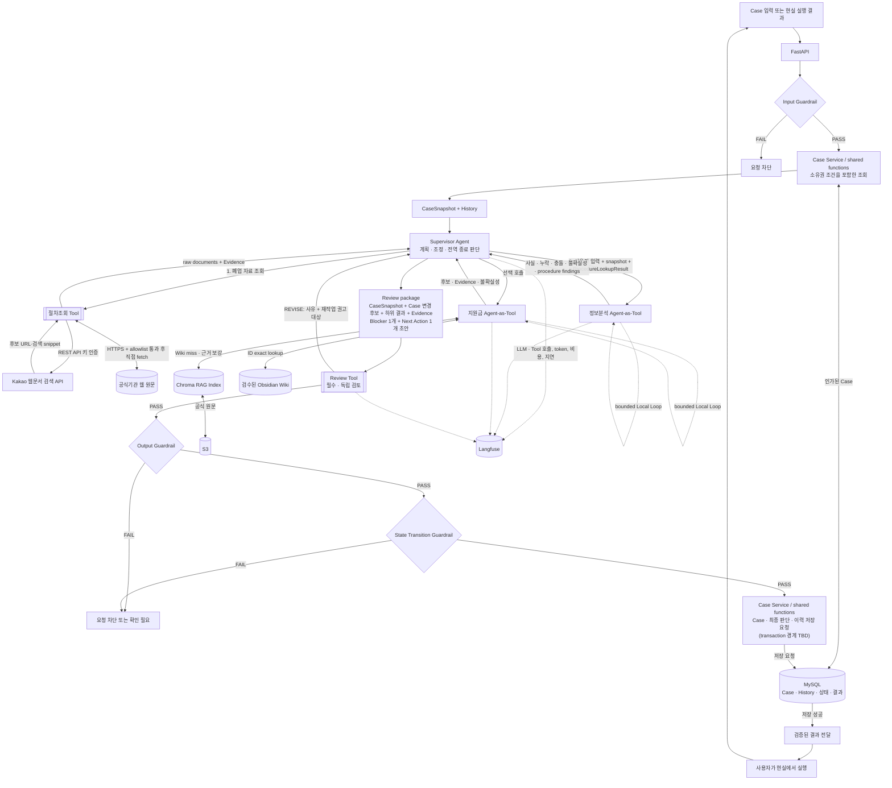

# RE:BORN Agent 아키텍처

> **상태 (2026-09-15):** 이 문서는 절차조회 Tool 재정의가 반영된 목표 구조를 정의합니다. 구현 현황은 `agent-standalone-runtime-requirements.md`에서 별도로 관리합니다.
>
> 필드·enum·API JSON 같은 세부 계약은 이 문서에서 정하지 않습니다. 이 문서는 구성요소의 책임, 호출 방향, 루프, 검증 경계만 다룹니다.

## 1. 확정 구조

RE:BORN의 전역 계획과 오케스트레이션은 **Supervisor Agent 한 곳**이 담당합니다.

- Supervisor는 현재 Case를 해석하고 필요한 하위 Agent·Tool만 선택 호출합니다.
- 정보분석 Agent와 지원금 Agent는 자기 작업을 끝내기 위한 제한된 Local Loop를 갖지만, Supervisor에는 Tool schema로 노출되는 **Agent-as-Tool**입니다.
- 절차조회 Tool과 Review Tool은 자체 계획·루프가 없는 일반 Tool입니다. 절차조회 Tool은 Kakao 웹문서 검색으로 공식 자료 URL을 발견하고 검증된 원문을 직접 읽지만, 그 내용을 해석하거나 Case 적용 여부를 판정하지 않습니다.
- 하위 구성요소끼리는 서로 호출하거나 메시지를 주고받지 않습니다.
- 절차조회 결과를 정보분석 Agent가 사용해야 할 때에도 Tool이 Agent를 직접 호출하지 않습니다. Supervisor가 `ProcedureLookupResult`를 `InfoAnalysisInput`에 넣어 전달합니다.
- Review Tool은 선택 호출 대상이 아니라 모든 정상 초안이 반드시 거치는 검증 관문입니다.
- 별도 Rule 엔진은 두지 않습니다. 결정적으로 판정 가능한 안전 조건만 코드 Guardrail로 강제합니다.

즉, “계획은 Supervisor가 맡고 나머지는 Tool로 호출한다”는 말은 **오케스트레이션 인터페이스**를 뜻합니다. 내부 Local Loop가 있는 정보분석·지원금 구성요소까지 일반 Tool이라는 뜻은 아닙니다.

| 구성요소 | 종류 | 책임 | 하지 않는 일 |
|---|---|---|---|
| **Supervisor Agent** | 상위 Agent | Case 해석, 호출 대상 선택, 결과 충분성 평가, Blocker 1개·Next Action 1개 결정, 재호출·되묻기·종료 판단 | Guardrail·Review 우회, 전문 근거 임의 생성 |
| **정보분석 Agent** | 하위 Agent-as-Tool | 사용자 입력·CaseSnapshot·절차조회 원문 근거를 함께 분석해 사실·누락·충돌·불확실성과 canonical 절차에 결합된 `procedure_findings` 생성 | 인터넷 직접 검색, 검색 결과에 없는 절차 생성, DB 절차 ID 생성, 전역 오케스트레이션, Case 직접 변경 |
| **지원금 Agent** | 하위 Agent-as-Tool | 검색 계획, Wiki/RAG 조회, 후보 비교, 공식 출처·최신성 확인, 필요하면 자기 범위에서 재검색 | 지원 자격·수령 확정, 다른 Agent 호출, 검수 Wiki 자동 수정 |
| **절차조회 Tool** | 일반 Tool | Kakao 웹문서 검색으로 폐업 관련 URL 발견, HTTPS·공식기관 allowlist 검증, 공식 원문 직접 fetch, raw document와 Evidence 정규화 | 검색 snippet을 Evidence로 사용, 원문 해석, 적용 여부·선후관계·우선순위·Next Action·절차 완료 판정, DB ID 생성 |
| **Review Tool** | 필수 LLM Tool | 전달받은 Case·초안·Evidence만으로 사실성, 근거, 표현, 실행 가능성을 독립 검토 | 새 근거 검색, 직접 수정, 재호출 대상 확정, 자체 반복 |
| **Guardrail** | 코드 | 입력, 상태 전이, 출력에서 결정 가능한 안전 조건 강제 | 업무 판단, Evidence의 의미 판단 |
| **Case Service / shared functions** | 코드 경계 | 인증된 Case 조회와 DB 쓰기의 단일 경로 | Agent 판단 대체 |

## 2. Rule 엔진을 없앤 이유

기존 구조는 절차 선후관계와 Next Action 우선순위를 Rule 엔진이 결정했습니다. 이 경우 LLM은 앞에서 자연어를 파싱하고 뒤에서 정해진 결과를 문장으로 바꾸는 역할만 남아, 문서에 적었던 것처럼 자율적인 Agent 구조가 아니었습니다.

Rule 엔진을 둔 목적은 지원 자격·금액·세무 내용을 함부로 단정하지 못하게 하는 것이었습니다. 그러나 존재하지 않는 지원사업명, 잘못된 금액·기한 같은 심각한 오류는 사실을 생성하거나 조회하는 시점에 생기므로, 뒤의 Rule만으로 막을 수 없습니다.

따라서 방어선을 다음처럼 옮깁니다.

- 공식 Evidence가 없는 지원사업명·금액·기한은 확정 문장으로 만들지 않습니다.
- 출처가 없거나 오래됐거나 Case 조건이 부족하면 `확인 필요`로 다룹니다.
- 절차조회 Tool은 실제 인터넷에서 공식 원문을 가져오고, 정보분석 Agent가 그 원문을 Case 문맥에서 분석하며, 최종 우선순위는 Supervisor가 판단합니다.
- 소유권·상태 전이·출력 형식처럼 확률에 맡길 수 없는 항목만 코드가 강제합니다.

## 3. 전체 실행 흐름



Blocker·Next Action을 포함하는 정상 결과의 최종 전달 조건은 **적용되는 Guardrail PASS와 Review PASS를 모두 만족하는 것**입니다. Supervisor가 Review를 생략하는 분기는 만들지 않습니다.

첫 계획의 데이터 의존 순서는 **절차조회 → 정보분석 → 지원금 → Supervisor 초안 → Review**입니다. 이 순서는 하위 구성요소가 서로 호출한다는 뜻이 아니라, Supervisor가 앞 호출의 검증된 결과를 다음 호출 입력에 전달한다는 뜻입니다. 검색 URL 발견과 공식 원문 fetch를 분리한 이유는 Kakao 응답의 `contents`가 검색용 일부 문구일 뿐 공식 원문 자체가 아니기 때문입니다.

위 그림은 논리적 검증 순서를 나타냅니다. Case 상태와 최종 판단을 몇 개의 짧은 트랜잭션으로 나눌지, 재계획 실패 시 앞선 상태 변경을 유지할지는 아직 BE 계약 전이므로 확정하지 않습니다.

## 4. 루프와 권한

| 루프 | 소유자 | 범위 |
|---|---|---|
| **Global Loop** | Supervisor Agent | 필요한 Agent·Tool 선택, 결과 평가, 재호출, 되묻기, 종료 |
| **정보분석 Local Loop** | 정보분석 Agent | 사실 추출·Case 비교·누락/충돌 확인·재분석 |
| **지원금 Local Loop** | 지원금 Agent | 검색 계획·Wiki/RAG 조회·원문 확인·검색 전략 보정 |
| **Review 반송** | Supervisor Agent | Review는 사유와 권고 대상만 반환하고, 무엇을 다시 호출할지는 Supervisor가 결정 |
| **Reality Loop** | 서비스 전체 | 사용자 실행 → 결과 입력 → Case 갱신 → 전체 재계획 |

- Local Loop는 해당 작업을 완료하기 위한 내부 반복일 뿐, 전역 계획 권한을 갖지 않습니다.
- 하위 Agent는 서로를 호출하지 않으며 사용자에게 되물을지 결정하지 않습니다.
- Local Loop에는 반드시 실행 상한이 있어야 하지만, 정확한 횟수·시간은 구현 계약에서 정합니다.
- Review `REVISE`에 따른 재계획은 **최대 2회**입니다. 그래도 통과하지 못하면 검토되지 않은 Blocker·Next Action은 폐기하고, 실패 이유와 확인 요청만 담은 안전 실패 응답을 Output Guardrail을 거쳐 반환합니다.
- 초안이 바뀌면 이전 Review 결과를 재사용하지 않습니다.
- Review가 절차 원문 누락·fetch 실패를 지적하면 절차조회부터, 원문 해석 오류를 지적하면 정보분석부터 다시 실행합니다. 따라서 재작업 순서도 `PROCEDURE_TOOL → INFO_AGENT → SUPPORT_AGENT → SUPERVISOR` 의존성을 따릅니다.
- 추가 질문·사용자 확인 요청처럼 도메인 판단이 들어간 Supervisor 응답도 Review 대상입니다. Input·State Transition·Output Guardrail이 만든 비계획 오류와 재시도 상한 도달 시의 안전 실패 응답만 Review PASS 대상에서 제외합니다. Agent 내부 `SafeFailureOutcome` schema는 확정돼 있으며, BE HTTP 오류 코드·상태·저장 정책 매핑만 생산 연동 TBD입니다.

## 5. Guardrail과 Review의 경계

### 5.1 코드 Guardrail — 결정 가능한 세 지점

| 지점 | 코드가 강제하는 것 |
|---|---|
| **Input** | 요청 형식·필수 필드, 인증·Case 소유권, 허용된 요청 여부 |
| **State Transition** | 상태 전이 유효성, 이미 확인된 값의 자동 덮어쓰기 금지, 허용되지 않은 상태 변경 차단, Case Service 경유 |
| **Output** | 응답 형식·필수 정보, 허용된 값, 민감정보 필터링, 출력 계약 준수 |

Guardrail은 자연어끼리 의미가 충돌하는지, “이 변경에 사용자 확인이 필요한가”, “이 Evidence가 주장을 충분히 뒷받침하는가”처럼 문맥을 읽어야 하는 판단을 하지 않습니다. 이 판단은 Supervisor와 Review가 담당하고, 코드는 확인되지 않은 변경을 저장하지 못하게 강제합니다.

### 5.2 Review Tool — 문맥을 읽어야 하는 품질 검증

Review Tool은 Supervisor와 분리된 프롬프트·실행 컨텍스트에서 다음을 확인합니다. 다른 LLM 모델을 써야 하는 것은 아니며, 독립된 관점이 유지되는지가 핵심입니다.

- Agent 결과가 Case와 일치하는가
- 주장에 필요한 Evidence가 실제로 첨부됐고 해당 주장을 뒷받침하는가
- 정보분석의 `procedure_findings`가 같은 실행의 `ProcedureLookupResult`에 포함된 공식 원문 Evidence에서 도출됐는가
- 근거 없는 단정이나 과도한 확신이 없는가
- Blocker와 Next Action이 현재 상황에 맞고 현실에서 실행 가능한가
- Next Action의 required `PROCEDURE | SUPPORT_PROGRAM` target이 각각 정확히 한 Info finding 또는 Support check와 Evidence에 연결되는가
- 사용자 확인이 필요한 내용을 임의로 확정하지 않았는가
- 불필요한 전문용어와 모호한 표현이 없는가

Review는 새 Evidence를 검색하지 않습니다. 필요한 Evidence가 없으면 즉시 `REVISE`하고, 문제·사유·누락 근거·재작업 권고 대상을 반환합니다. 초안을 직접 고치거나 하위 Agent를 직접 호출하지 않습니다.

## 6. Evidence, 절차조회와 지원금 조회

```text
폐업 관련 검색 질의
  → Kakao 웹문서 검색 API에서 후보 URL 발견
  → HTTPS 및 공식기관 domain allowlist 검증
  → 검증된 URL의 실제 원문 직접 fetch
       ├─ 성공: sanitized excerpt + URL + 기관 + 조회시각 + hash를 Evidence로 반환
       └─ 실패/차단: warning 또는 부분 결과; 검색 snippet으로 대체하지 않음
  → Supervisor가 raw ProcedureLookupResult를 정보분석 Agent에 전달
  → 정보분석 Agent가 canonical KnownProcedureStep에만 procedure finding 결합
```

검색 질의는 Case의 확정된 업종·사업자 유형·직원 수와 redacted 입력의 제한된
키워드(`카페`, `음식점`, `법인`, `직원` 등)로 **미리 정의된 비식별 검색어만
선택**합니다. 사용자 문장이나 주소를 검색 API로 복사하지 않으므로 첫 자연어
입력에서도 업종별 자료를 찾되, 검색 질의 생성이 정보분석을 대신하지 않습니다.

- 외부 웹문서의 본문은 **명령이 아니라 신뢰하지 않는 데이터**입니다. 문서에 포함된 prompt, 링크 이동 지시, credential 요청을 실행하지 않습니다.
- `source_policy=OFFICIAL_ONLY`이며 최종 URL과 모든 redirect hop은 HTTPS와 공식기관 allowlist를 통과해야 합니다. 현재 runtime은 IP-literal과 credential 포함 URL을 거부합니다. hostname DNS 해석 결과의 private/loopback/link-local 차단과 DNS rebinding 방어는 production egress/resolver 경계에서 추가해야 합니다.
- Kakao 검색 결과의 제목·`contents`·작성시각은 URL 발견과 후보 정렬에만 사용합니다. 직접 fetch한 실제 공식 원문만 `OFFICIAL_DOCUMENT` Evidence가 될 수 있습니다.
- `published_at` 또는 최신성을 확인하지 못하면 `freshness_status=UNKNOWN`입니다. 정보분석·Supervisor는 이 근거로 기한·필수서류·법적 의무를 확정형으로 말하지 않습니다.
- 인터넷 자료만으로 `CASE_COMPLETE`를 만들거나 절차 진행상태를 저장하지 않습니다. 완료에는 사용자 실행, 전문가 확인, 공식 처리 결과처럼 현실 실행을 증명하는 별도 Evidence가 필요합니다.

```text
검수된 지원항목 ID가 있음
  └─ Obsidian Wiki에서 ID exact lookup

Wiki miss 또는 근거 보강 필요
  └─ Chroma에서 관련 공식 원문 검색
       └─ S3 원문과 최신성 확인
            ├─ 충분함: 후보 + Evidence 반환
            └─ 부족함: 검색 전략 보정 또는 확인 불가 반환
```

- 지원금 Agent는 검수된 Wiki를 자동 수정하지 않습니다.
- 공식 출처가 없거나 `STALE`이면 지원 자격·금액·기한을 확정하지 않습니다.
- 지원기관의 최종 심사 전에는 “지원 가능 확정”이나 “수령 확정”으로 표현하지 않습니다.
- 정보분석의 사용자 발화 근거는 원문 전체가 아니라 필요한 source span과 출처 유형으로 전달합니다.

## 7. 역할 기반으로 나눈 이유

임대차·철거·세무·지원금처럼 도메인마다 Agent를 추가하면 도메인이 늘 때마다 오케스트레이션 구조도 커지고, 어느 판단이 결과를 만들었는지 추적하기 어려워집니다.

따라서 전역 판단은 Supervisor에 모으고 하위 구성요소는 정보 분석, 근거 조회, 절차 조회, 품질 검토라는 역할로 나눕니다. 2차 MVP에서 세무·철거 범위를 확장할 때도 먼저 지식원과 필요한 조회 Tool을 추가하며, 독립된 계획·Local Loop가 필요한 근거가 생기기 전에는 새 Agent를 만들지 않습니다.

## 8. 프레임워크와 관측성

| 기술 | 사용 범위 |
|---|---|
| **LangChain** | LLM 연결, Agent-as-Tool/일반 Tool 어댑터, 구조화 출력 |
| **LangGraph** | Supervisor Global Loop, Worker Local Loop, 필수 Review 경로, 종료·재시도 상태 관리 |
| **Langfuse** | LLM·Tool 호출 수, token·비용, 지연, 오류, Review 반송, 실행 trace 관찰 |

- Response Writer는 판단 노드나 별도 Agent가 아닙니다. Supervisor가 결정한 Blocker·Next Action을 출력 계약에 맞게 직렬화하는 단계입니다.
- Agent별로 다른 모델을 써야 하는 것은 아닙니다. 프롬프트, 허용된 입력, 상태와 실행 컨텍스트를 분리해 독립성을 확보합니다.
- Langfuse에는 인증 토큰과 민감한 원문을 그대로 기록하지 않습니다. 상세 보존·마스킹 정책은 구현 전에 확정합니다.
- MySQL에는 Case의 최종 상태와 업무 감사 이력을, Langfuse에는 중간 LLM·Tool 실행과 비용 관측 정보를 남깁니다. 구조도에서 말하는 MySQL의 Agent trace는 전체 프롬프트 원문이 아니라 최종 결과를 연결하는 감사용 식별자·요약을 뜻하며, 두 저장소의 정확한 공통 식별자와 보존 범위는 아직 TBD입니다.

## 9. MVP 범위

### 1차 MVP

- Supervisor Agent
- 정보분석 Agent-as-Tool
- 지원금 Agent-as-Tool
- 절차조회 Tool
- 필수 Review Tool
- Input / State Transition / Output Guardrail
- Wiki → Chroma → S3 근거 조회 경로

### 2차 MVP 확장

- 세무·철거 지식원과 필요한 조회 Tool
- 현재 구조로 표현할 수 없는 독립 목표와 bounded loop가 확인될 때만 별도 Agent 여부 재검토

## 10. 구현 소유권과 생산 연동 TBD

| 구분 | 소유 |
|---|---|
| Supervisor·하위 Agent·Tool 동작, 프롬프트, Agent 입출력 schema, 절차조회 Tool, LangGraph·Langfuse 구성 | AI |
| 인증·소유권, DB API, Case Service/shared functions, 물리 DB·migration, 상태 전이 코드, 트랜잭션 | BE |
| CaseSnapshot, Evidence 식별자 연결, 최종 결과 저장 DTO, 오류·실패 계약 | AI가 필요 schema를 제안하고 BE와 인터페이스 확정 |

Agent 내부의 v2 입출력·Review schema와 로컬 retry/timeout은
`agent-tool-io-schema.md`와 실행 코드에 확정돼 있습니다. 아래는 그 schema를
BE HTTP·DB·운영 경계에 연결하기 전에 공동 계약이 더 필요한 항목입니다.

- BE/gateway 전체 deadline과 Agent 내부 retry/timeout의 소유권·중복 실행 방지
- `ComponentRequest`/`ComponentResult` HTTP envelope와 BE 영속 Evidence ID 발급·resolver 형식
- Kakao 검색 credential 운영, 공식기관 allowlist 변경 승인, DNS rebinding/egress와 quota 관측
- 인터넷 조회 Evidence의 canonical URL·본문 hash·조회시각 보존과 캐시/재검증 정책
- BE canonical `ProcedureStepRef` registry 공급·버전 관리와 미매핑 finding 처리
- Review 결과·`ReviewProof`의 외부 HTTP 오류 매핑과 저장 승인 절차
- 동시 변경 방지 방식(`case.version`/`expectedVersion` 또는 대안)
- Case 갱신·최종 판단·History 저장의 정확한 트랜잭션 경계
- MySQL 업무 이력과 Langfuse 실행 trace에 각각 남길 정보와 보존 정책

LLM 호출과 외부 조회를 긴 DB 트랜잭션 안에서 실행하지 않는다는 원칙은 유지합니다. Case 변경과 그 변경 이력의 원자성, Review 최종 실패 시 저장 상태는 BE 계약이 확정된 뒤 반영합니다.

## 11. 불변식

- Blocker 1개와 Next Action 1개의 최종 판단은 Supervisor만 합니다.
- 하위 Agent·Tool은 서로 직접 호출하거나 메시지를 주고받지 않습니다.
- Review는 모든 정상 초안에 필수이며 Supervisor가 건너뛸 수 없습니다.
- Review는 전달받은 Evidence만 검증하고 새 근거를 만들거나 찾지 않습니다.
- Agent와 Tool은 DB를 직접 변경하지 않습니다.
- 절차조회 Tool은 raw 원문과 Evidence만 반환하며 적용성·준비상태·완료·우선순위를 판정하지 않습니다.
- 정보분석 Agent는 caller가 제공한 `KnownProcedureStep`에만 finding을 결합하고 새 DB step ID/code를 만들지 않습니다.
- Kakao 검색 snippet이나 allowlist를 통과하지 않은 페이지는 Evidence가 아닙니다.
- 근거 없는 지원사업명·금액·기한·자격 확정 문장을 사용자에게 내보내지 않습니다.
- 판단, 호출, 반송, 실패 원인은 추적할 수 있어야 합니다.

## 12. 외부 기술 근거

- [Kakao Daum 검색 REST API 개발 가이드](https://developers.kakao.com/docs/ko/daum-search/dev-guide): 웹문서 검색 endpoint, `Authorization: KakaoAK ${REST_API_KEY}`, query/page/size와 검색 결과의 title/contents/url/datetime 계약
- [Kakao REST API 시작하기](https://developers.kakao.com/docs/ko/rest-api/getting-started): 서버 환경에서 REST API를 호출할 수 있다는 공식 안내
- [Kakao 앱 키 설정](https://developers.kakao.com/docs/ko/app-setting/app): REST API 키의 발급·관리·호출 허용 IP 설정 근거
- [Kakao 쿼터 안내](https://developers.kakao.com/docs/ko/getting-started/quota): Daum 검색 사용량과 쿼터가 변경될 수 있으므로 timeout·rate limit·운영 관측이 필요하다는 근거
